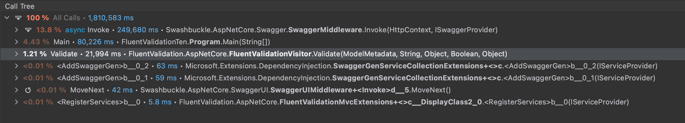

# ASP.NET Core MVC Validation Rodeo

Testing the performance profile of ASP.NET Core MVC validation frameworks using a real-world use case:

- Data Annotations
- Fluent Validation

Testing to see:

- Throughput (req/sec)
- dotTrace Profiler

Using [JetBrains Rider](https://jetbrains.com/rider) profiling and [K6](https://k6.io).

## Fluent Validation

```console
          /\      |‾‾| /‾‾/   /‾‾/   
     /\  /  \     |  |/  /   /  /    
    /  \/    \    |     (   /   ‾‾\  
   /          \   |  |\  \ |  (‾)  | 
  / __________ \  |__| \__\ \_____/ .io
  execution: local
     script: script.js
     output: -

  scenarios: (100.00%) 1 scenario, 10 max VUs, 1m0s max duration (incl. graceful stop):
           * default: 10 looping VUs for 30s (gracefulStop: 30s)


running (0m30.1s), 00/10 VUs, 74200 complete and 0 interrupted iterations
default ✓ [======================================] 10 VUs  30s

     data_received..............: 47 MB   1.6 MB/s
     data_sent..................: 20 MB   670 kB/s
     http_req_blocked...........: avg=21µs    min=0s       med=2µs    max=143.7ms  p(90)=2µs    p(95)=3µs   
     http_req_connecting........: avg=48ns    min=0s       med=0s     max=434µs    p(90)=0s     p(95)=0s    
     http_req_duration..........: avg=3.96ms  min=682µs    med=1.02ms max=1.77s    p(90)=1.57ms p(95)=1.89ms
     http_req_failed............: 100.00% ✓ 74200 ✗ 0   
     http_req_receiving.........: avg=27.64µs min=11µs     med=25µs   max=2.86ms   p(90)=38µs   p(95)=44µs  
     http_req_sending...........: avg=12.09µs min=5µs      med=11µs   max=1.74ms   p(90)=16µs   p(95)=18µs  
     http_req_tls_handshaking...: avg=19.23µs min=0s       med=0s     max=142.81ms p(90)=0s     p(95)=0s    
     http_req_waiting...........: avg=3.92ms  min=656µs    med=987µs  max=1.77s    p(90)=1.52ms p(95)=1.83ms
     http_reqs..................: 74200   2461.823325/s
     iteration_duration.........: avg=4.04ms  min=718.41µs med=1.08ms max=1.92s    p(90)=1.64ms p(95)=1.97ms
     iterations.................: 74200   2461.823325/s
     vus........................: 10      min=10  max=10
     vus_max....................: 10      min=10  max=10
```

and dotTrace Profile.



## Data Annotations

```console
          /\      |‾‾| /‾‾/   /‾‾/   
     /\  /  \     |  |/  /   /  /    
    /  \/    \    |     (   /   ‾‾\  
   /          \   |  |\  \ |  (‾)  | 
  / __________ \  |__| \__\ \_____/ .io
  execution: local
     script: script.js
     output: -

  scenarios: (100.00%) 1 scenario, 10 max VUs, 1m0s max duration (incl. graceful stop):
           * default: 10 looping VUs for 30s (gracefulStop: 30s)


running (0m30.2s), 00/10 VUs, 76555 complete and 0 interrupted iterations
default ✓ [======================================] 10 VUs  30s

     data_received..............: 45 MB 1.5 MB/s
     data_sent..................: 21 MB 688 kB/s
     http_req_blocked...........: avg=31.45µs min=0s       med=1µs      max=228.73ms p(90)=2µs    p(95)=2µs   
     http_req_connecting........: avg=59ns    min=0s       med=0s       max=543µs    p(90)=0s     p(95)=0s    
     http_req_duration..........: avg=3.84ms  min=593µs    med=805µs    max=2.35s    p(90)=1.29ms p(95)=1.59ms
     http_req_receiving.........: avg=24.49µs min=11µs     med=21µs     max=5.1ms    p(90)=33µs   p(95)=38µs  
     http_req_sending...........: avg=11.07µs min=5µs      med=11µs     max=800µs    p(90)=14µs   p(95)=16µs  
     http_req_tls_handshaking...: avg=29.7µs  min=0s       med=0s       max=227.52ms p(90)=0s     p(95)=0s    
     http_req_waiting...........: avg=3.81ms  min=567µs    med=770µs    max=2.35s    p(90)=1.25ms p(95)=1.55ms
     http_reqs..................: 76555 2537.365445/s
     iteration_duration.........: avg=3.92ms  min=626.15µs med=852.07µs max=2.57s    p(90)=1.35ms p(95)=1.66ms
     iterations.................: 76555 2537.365445/s
     vus........................: 10    min=10 max=10
     vus_max....................: 10    min=10 max=10
```

and dotTrace Profile


## Conclusions

Data Annotations seems to have better throughput, but ultimately not by much. The CPU time spent in FluentValidation is also a bit longer. Ultimately the biggest bottlenecks will be the **kind** of validation, with both frameworks being hindered by the database call. 